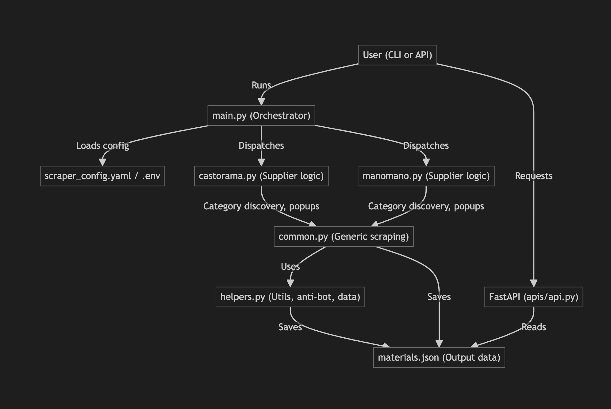

# Donizo Material Scraper


*Functional structure of the Donizo Material Scraper pipeline.*

## Overview

This project is a modular, production-ready Python web scraper for extracting real renovation material pricing data from major French suppliers (Castorama, ManoMano). It is designed for extensibility, clean data structuring, and easy integration with Donizo’s pricing engine or future APIs.

---

## Features
- Scrapes 100+ or more products across multiple dynamic categories (tiles, sinks, toilets, paint, vanities, showers, etc.)
- Handles pagination and anti-bot logic (stealth, waits)
- Deduplicates and structures data in JSON
- Configurable via YAML and .env
- Modular codebase for easy extension
- (Bonus) API endpoint for querying materials by category
- (Bonus) Streamlit UI for browsing and comparing products
- (Bonus) Price comparison using spaCy NLP for semantic matching

---

## Project Structure

```
donizo-material-scraper/
├── scrapers/
│   ├── main.py              # Entry point for scraping
│   ├── helpers.py           # Generic utilities
│   ├── castorama.py         # Castorama-specific logic
│   ├── manomano.py          # ManoMano-specific logic
│   ├── common.py            # Generic scraping logic
│   └── compare_prices.py    # (Bonus) Price comparison script
├── apis/
│   └── api.py               # (Bonus) API endpoint
├── config/
│   ├── scraper_config.yaml  # Selectors and category config
│   └── .env                 # Environment variables (limits, etc.)
├── data/
│   └── materials.json       # Scraped product data (output)
├── tests/
│   └── test_scraper.py      # Basic tests
├── streamlit_app.py         # (Bonus) Streamlit UI for browsing/comparing
├── run_all.sh               # Script to run API and Streamlit together
└── README.md
```

---

## Installation & Setup

1. **Install dependencies:**
   ```bash
   pip install -r requirements.txt
   python -m playwright install
   # For NLP-based comparison:
   pip install spacy
   python -m spacy download fr_core_news_md
   ```
   - If you use a different language, download the appropriate spaCy model.

2. **Configure limits and selectors:**
   - Edit `config/.env` for product/page/category limits.
   - Edit `config/scraper_config.yaml` for selectors and categories.

---

## How to Run the Scraper

```bash
# Scrape Castorama
python -m scrapers.main --supplier castorama

# Scrape ManoMano
python -m scrapers.main --supplier manomano

# Scrape all suppliers
python -m scrapers.main --supplier all
```
- Results are saved to `data/materials.json`.

---

## Output Format

Each product in `materials.json` is a JSON object with:
```json
{
  "name": "Faience murale blanche 20x20cm",
  "category": ["tiles", "wall"],
  "price": "12.99 €",
  "url": "https://www.castorama.fr/produit/12345",
  "brand": "Castorama",
  "unit": "20x20cm",
  "image_url": "https://www.castorama.fr/images/12345.jpg",
  "supplier": "Castorama",
  "category_primary": "Carrelage",
  "category_secondary": "Faience",
  "category_tertiary": "Blanc"
}
```
- Some fields (brand, unit, image_url, secondary/tertiary categories) may be null if not available.

---

## Data Assumptions & Transformations
- **Brand**: Inferred from the first word of the product name unless it’s a generic material word.
- **Unit/Pack Size**: Extracted from product name or a dedicated selector if available.
- **Deduplication**: Products are deduplicated by URL.
- **Pagination**: Follows next-page links up to the configured limit.
- **Anti-bot**: Uses stealth scripts, random user agents, and human-like scrolling.

---

## Pagination & Anti-bot Logic
- **Pagination**: The scraper automatically follows next-page links (or can be extended for infinite scroll/load-more).
- **Anti-bot**: Uses Playwright stealth, random user agents, and waits to avoid detection.

---

## Running Tests

1. **Run all tests (see all print/log output):**
   ```bash
   pytest -s tests/
   ```
2. **What is tested:**
   - Scraper runs and produces a non-empty `materials.json`.
   - Output contains required fields.

---

## (Bonus) API Endpoint

A simple FastAPI app is provided to query materials by category:

1. **Install FastAPI and Uvicorn:**
   ```bash
   pip install fastapi uvicorn
   ```
2. **Run the API:**
   ```bash
   uvicorn apis.api:app --reload
   ```
3. **Query by category:**
   - Example: [http://127.0.0.1:8000/materials/Jardin%20et%20ext%C3%A9rieur](http://127.0.0.1:8000/materials/Jardin%20et%20ext%C3%A9rieur)

**Sample API request:**
```bash
curl 'http://127.0.0.1:8000/materials/Jardin%20et%20ext%C3%A9rieur'
```

---

## (Bonus) Streamlit UI: Browsing & Price Comparison

A modern Streamlit app is provided for interactive browsing and price comparison:

1. **Install Streamlit:**
   ```bash
   pip install streamlit
   ```
2. **Run the UI:**
   ```bash
   streamlit run streamlit_app.py
   ```

### Features
- **Browse Tab:**
  - Filter by category and supplier
  - Product cards in a 3-column grid (e-commerce style)
  - Sidebar with sample API links
- **Compare Prices Tab:**
  - Click the **Compare** button to run semantic price comparison
  - Loader/spinner while results are being processed
  - Results shown as product cards, 3 per row, grouped by semantic similarity
  - Dynamic keyword filter (any language) for debug/inspection
  - Optional debug info (toggleable)
  - Uses spaCy NLP (fr_core_news_md) for semantic matching of product names and categories
  - Extensible for production use with a vector database

---

## (Bonus) Run API and Streamlit UI Together

A shell script is provided to run both the FastAPI server and Streamlit UI together:

```bash
bash run_all.sh
```
- This will start the API on port 8000 and the Streamlit UI on port 8501.
- When you exit Streamlit, the API server will be stopped automatically.

---


## Additional Notes

- **spaCy Model:**
  - The Streamlit app requires the French medium model for semantic comparison:
    ```bash
    pip install spacy
    python -m spacy download fr_core_news_md
    ```
- **Playwright:**
  - After installing Playwright, you must run:
    ```bash
    python -m playwright install
    ```
- **Requirements:**
  - All dependencies are listed in `requirements.txt`.
  - For full UI/UX, you need: `streamlit`, `spacy`, `fastapi`, `uvicorn`, `playwright`, and the spaCy French model.

---

## Extending the Scraper
- Add new suppliers by creating a new module in `scrapers/` and updating the config.
- Add new categories/selectors in `scraper_config.yaml`.
- The price comparison logic is extensible for production use with a vector database or more advanced NLP.

---

## Contact
For questions or feedback, please contact the project maintainer.